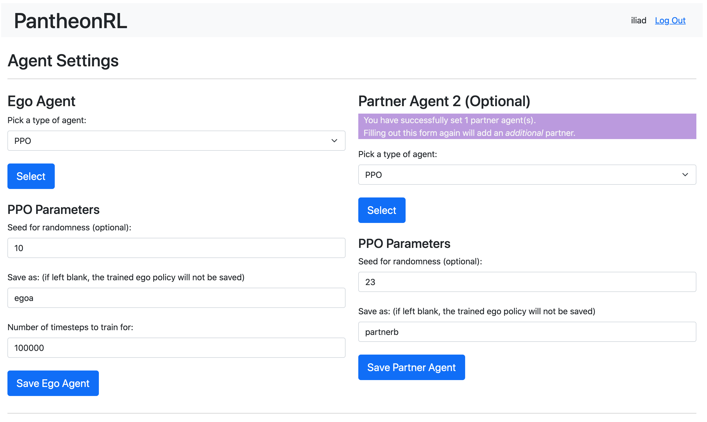
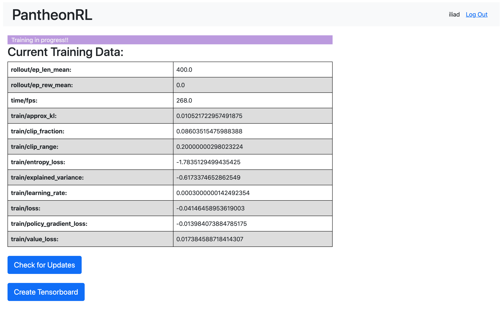

# PantheonRL

PantheonRL is a package for training and testing multi-agent reinforcement learning environments. The goal of PantheonRL is to provide a modular and extensible framework for training agent policies, fine-tuning agent policies, ad-hoc pairing of agents, and more. PantheonRL also provides a web user interface suitable for lightweight experimentation and prototyping.


PantheonRL is built on top of StableBaselines3 (SB3), allowing direct access to many of SB3's standard RL training algorithms such as PPO. PantheonRL currently follows a decentralized training paradigm -- each agent is equipped with its own replay buffer and update algorithm. The agents objects are designed to be easily manipulable. They can be saved, loaded and plugged into different training procedures such as self-play, ad-hoc / cross-play, round-robin training, or finetuning.

This package will be presented as a demo at the AAAI-22 Demonstrations Program.

[Demo Paper](https://arxiv.org/abs/2112.07013)

[Demo Video](https://youtu.be/3-Pf3zh_Hpo)

```
"PantheonRL: A MARL Library for Dynamic Training Interactions"
Bidipta Sarkar*, Aditi Talati*, Andy Shih*, Dorsa Sadigh
In Proceedings of the 36th AAAI Conference on Artificial Intelligence (Demo Track), 2022

@inproceedings{sarkar2021pantheonRL,
  title={PantheonRL: A MARL Library for Dynamic Training Interactions},
  author={Sarkar, Bidipta and Talati, Aditi and Shih, Andy and Sadigh Dorsa},
  booktitle = {Proceedings of the 36th AAAI Conference on Artificial Intelligence (Demo Track)},
  year={2022}
}
```

-----

## Installation
```
# Optionally create conda environments
conda create -n PantheonRL python=3.7
conda activate PantheonRL

# downgrade setuptools for gym=0.21
pip install setuptools==65.5.0 "wheel<0.40.0"

# Clone and install PantheonRL
git clone https://github.com/Stanford-ILIAD/PantheonRL.git
cd PantheonRL
pip install -e .
```


### Overcooked Installation
```
# Optionally install Overcooked environment
git submodule update --init --recursive
pip install -e overcookedgym/human_aware_rl/overcooked_ai
```

### PettingZoo Installation
```
# Optionally install PettingZoo environments
pip install pettingzoo

# to install a group of pettingzoo environments
pip install "pettingzoo[classic]"
```

## Command Line Invocation


#### Example
```
python3 trainer.py LiarsDice-v0 PPO PPO --seed 10 --preset 1
```

```
# requires Overcooked installation (see above instructions)
python3 trainer.py OvercookedMultiEnv-v0 PPO PPO --env-config '{"layout_name":"simple"}' --seed 10 --preset 1
```

For examples on round-robin training followed by partner adaptation, check out these [instructions](overcookedgym/OvercookedAdaptPartnerInstructions.md).

For more examples, check out the ```examples/``` [directory](examples/).

## Web User Interface

The first time the web interface is being run in a new location, the database must be initialized. After that, the ``init-db`` command should not be called again, because this will clear all user account data.

Set environment variables and (re)inititalize the database
```
export FLASK_APP=website
export FLASK_ENV=development
flask init-db
```

Start the web user interface. Make sure that ports 5000 and 5001 (used for Tensorboard) are not taken.
```
flask run --host=0.0.0.0 --port=5000
```

<p align="center">
  
  <br>
  <i>Agent selection screen. Users can customize the ego and partner agents.</i>
</p>

<p align="center">
  
  <br>
  <i>Training screen. Users can view basic information, or spawn a Tensorboard tab for full monitoring.</i>
</p>


## Features

| **General Features**        | **PantheonRL** |
| --------------------------- | ----------------------|
| Documentation               | :heavy_check_mark: |
| Web user interface          | :heavy_check_mark: |
| Built on top of SB3         | :heavy_check_mark: |
| Supports PettingZoo Envs    | :heavy_check_mark: |


| **Environment Features**    | **PantheonRL** |
| --------------------------- | ----------------------|
| Frame stacking (recurrence) | :heavy_check_mark: |
| Simultaneous multiagent envs| :heavy_check_mark: |
| Turn-based multiagent envs  | :heavy_check_mark: |
| 2-player envs               | :heavy_check_mark: |
| N-player envs               | :heavy_check_mark: |
| Custom environments         | :heavy_check_mark: |


| **Training Features**           | **PantheonRL** |
| ------------------------------- | ----------------------|
| Self-play                       | :heavy_check_mark: |
| Ad-hoc / cross-play             | :heavy_check_mark: |
| Round-robin training            | :heavy_check_mark: |
| Finetune / adapt to new partners| :heavy_check_mark: |
| Custom policies                 | :heavy_check_mark: |


#### Current Environments

| **Name**              | **Environment Type**  | **Reward Type**  | **Players**     | **Visualization**   |
| --------------------- | --------------------- | ---------------- | --------------- | ------------------- |
| Rock Paper Scissors   | SimultaneousEnv       | Competitive      | 2               | :x:                 |
| Liar's Dice           | TurnBasedEnv          | Competitive      | 2               | :x:                 |
| Block World [[1]](#1) | TurnBasedEnv          | Cooperative      | 2               | :heavy_check_mark:  |
| Overcooked [[2]](#2)  | SimultaneousEnv       | Cooperative      | 2               | :heavy_check_mark:  |
| PettingZoo [[3]](#3)  | Mixed                 | Mixed            | N               | :heavy_check_mark:  |

<a id="1">[1]</a>
Adapted from the block construction task from https://github.com/cogtoolslab/compositional-abstractions

<a id="2">[2]</a>
Adapted from the Human_Aware_Rl / Overcooked AI package from https://github.com/HumanCompatibleAI/human_aware_rl

<a id="3">[3]</a>
PettingZoo environments from https://github.com/Farama-Foundation/PettingZoo
